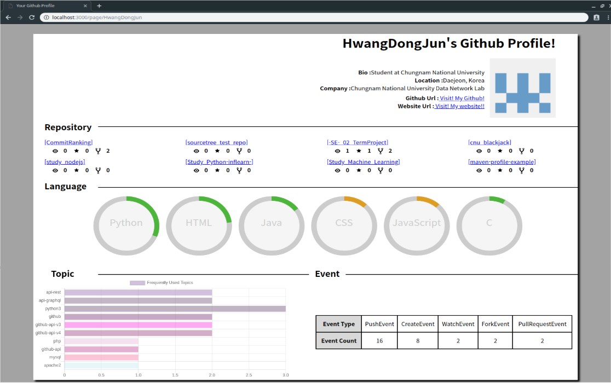

# Automatic resume generation tool using Github
Github Data를 활용한 이력서 자동 제작 도구

1. Getting Started (Window환경)
	- [Node.js](https://nodejs.org/ko/)를 설치
	- Node.js command prompt 실행
	- Automatic resume generation tool using Github폴더 접속 후 node main_node.js 입력

2. Explanation
	- 대표적인 오픈 소스 개발 커뮤니티인 Github의 User Data를 수집 및 분석하여 이력서 자동 제작 도구를 만든다.
	- Nodejs의 module인 express를 사용한 jade 웹페이지

3. Crawler
	- Python3에서 Github API v3/v4를 사용하여 데이터를 수집한다.  
	
	|
요소
|
설명
|
	|:-----:|:-----:|
	|
Bio
|
자기소개
|
	|
Location
|
거주지
|
	|
Company
|
소속
|
	|
Github URL
|
Github Page URL
|
	|
Website URL
|
웹페이지
|
	|
Profile picture
|
사진
|
	|
Repository
|
프로젝트 저장소
|
	|
Fork
|
다른 Repository의 히스토리를 자신의 Repository로 복사
|
	|
Language
|
프로그래밍 언어
|
	|
Topic
|
프로젝트 탐색 레이블
|
	|
Event
|
프로젝트 활동
|

4. Analyzer
	- User Information
	- Repository
		- Commit 횟수가 많은 8개를 선정하여 표시
		- 각 Repository의 Watch, Star, Fork count 표시
	- Language
		- User가 사용한 프로그래밍 언어의 사용 비율을 내림차순으로 정렬하여 6개 선정
	- Topic
		- User가 지정한 Topic의 빈도수를 Bar Chart로 표시
	- Event
		- User가 활동한 Event의 횟수를 Table로 표시

5. Result
	

#### ※ 본 프로젝트는 아직 개발 중임을 밝힙니다. (2019-06-03~)
