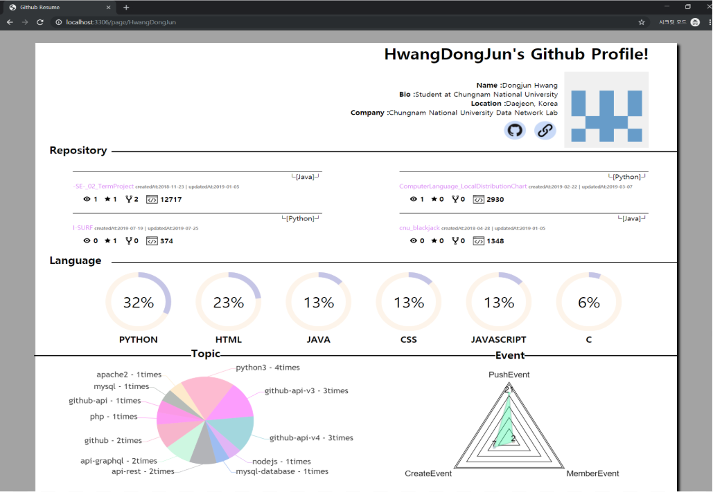

# Automatic resume generation tool using Github
Github Data를 활용한 이력서 자동 제작 도구

1. Getting Started (Window환경)
	- [Node.js](https://nodejs.org/ko/)를 설치 후, Node.js command prompt 실행
	```
	> cd Automatic resume generation tool using Github
	> node main_page.js
	```
	- [localhost](localhost:3306/page/main_page)에 접속하여 필요한 정보 입력

2. Explanation
	- 대표적인 오픈 소스 개발 커뮤니티인 Github의 User Data를 수집 및 분석하여 이력서 자동 제작 도구
	- Nodejs의 module인 express를 사용한 jade 웹페이지

3. Crawler
	- Python3에서 Github API v3/v4를 사용하여 데이터를 수집한다. <br>
	
	|<center>요소</center>|<center>설명</center>|
	|:-----:|:-----:|
	|<center>Bio</center>|<center>자기소개</center>|
	|<center>Location</center>|<center>거주지</center>|
	|<center>Company</center>|<center>소속</center>|
	|<center>Github URL</center>|<center>Github Page URL</center>|
	|<center>Website URL</center>|<center>웹페이지</center>|
	|<center>Profile picture</center>|<center>사진</center>|
	|<center>Repository</center>|<center>프로젝트 저장소</center>|
	|<center>Fork</center>|<center>다른 Repository의 히스토리를 자신의 Repository로 복사</center>|
	|<center>Language</center>|<center>프로그래밍 언어</center>|
	|<center>Topic</center>|<center>프로젝트 탐색 레이블</center>|
	|<center>Event</center>|<center>프로젝트 활동</center>|

4. Analyzer
	- User Information
	- Repository
		- 선정 기준 7가지를 토대로 Repository 4개 선정
			- [1] master를 제외한 branch를 사용한 것을 최고 우선순위로 선정한다.
				- [1.1] 4개초과 : 종합점수에서 상위 4개 선정한다.
				- [1.2] 4개미만 : master branch이외에 다른 branch가 존재하지 않는 repository 중 높은 점수를 가진 것으로 나머지를 채운다.
			- [2] Collaborator들의 여부에 따라 점수로 변경한다.
				- [2.1] Collaborator의 수에 따라 1점씩 준다.
			- [3] License 여부에 따라 점수로 변경한다.
				- [3.1] License가 있다면 1점, 없다면 0점을 준다.
			- [4] 개인 commit / 전체 commit 을 계산하여 점수로 변경한다.
			- [5] 개인 issue / 전체 issue 를 계산하여 점수로 변경한다.
			- [6] 자신이 올린 issue를 제외한 issue에 comment를 단 횟수에 따라 점수로 변경한다.
			- [7] pullRequest를 확인한다.
				- [7.1] 직접 올린 pullRequest라면 MERGED > OPEN > CLOSED 순으로 점수를 준다. (MERGED : 8, OPEN : 4, CLOSED : 2)
				- [7.2] 직접 올리지 않았다면 participants에 사용자가 포함되었는지 확인한다. (포함되었다면 5점을 부여)
				- [7.3] pullRequest마다 실행한 commit_count를 점수에 추가한다.
		- 각 Repository의 Watch, Star, Fork count 표시
		- 각 Repository의 Code line 표시
	- Language
		- User가 사용한 프로그래밍 언어의 사용 비율을 정렬하여 상위 6개 선정
	- Topic
		- User가 지정한 Topic의 빈도수를 Bar Chart로 표시
	- Event
		- User가 활동한 Event의 횟수를 Radar Chart로 표시

5. Result
	

#### ※ 본 프로젝트는 아직 개발 중임을 밝힙니다. (2019-06-03~)
##### 1차 수정 : 2019-07-27
